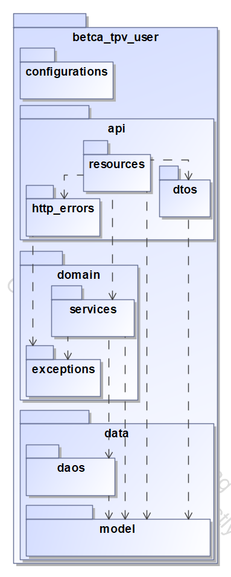
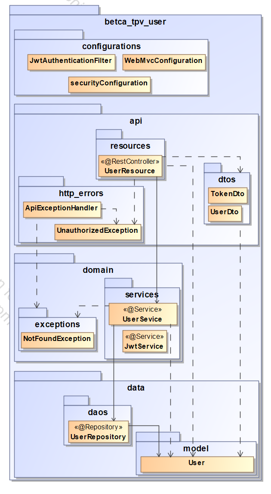
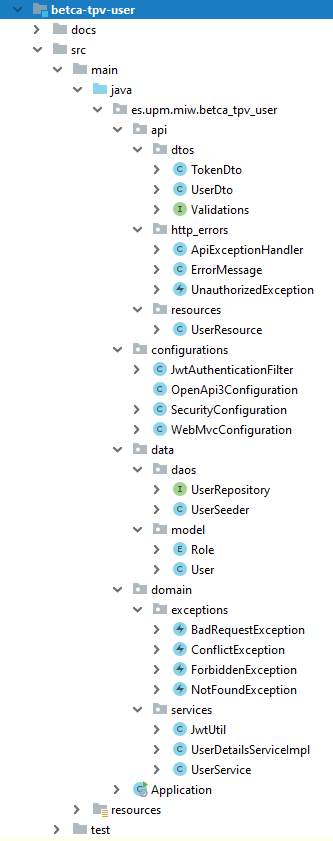

## [Máster en Ingeniería Web por la Universidad Politécnica de Madrid (miw-upm)](http://miw.etsisi.upm.es)
## Back-end con Tecnologías de Código Abierto (BETCA).
> Aplicación TPV. Pretende ser un ejemplo práctico y real de todos los conocimientos vistos

### Tecnologías necesarias
`Java` `Maven` `GitHub` `Spring-boot` 

### :gear: Instalación del proyecto
1. Clonar el repositorio en tu equipo, **mediante consola**:
```sh
> cd <folder path>
> git clone https://github.com/miw-upm/betca-tpv-spring
```
2. Importar el proyecto mediante **IntelliJ IDEA**
   1. **Import Project**, y seleccionar la carpeta del proyecto.
   1. Marcar **Create Project from external model**, elegir **Maven**.
   1. **Next** … **Finish**.   
3. Ejecución.
   1. Desplegar el proyecto localmente: `> mvn clean install`
   1. Arrancar el proyecto: `> mvn spring-boot:run -pl shop-application`

## :book: Documentación del proyecto



